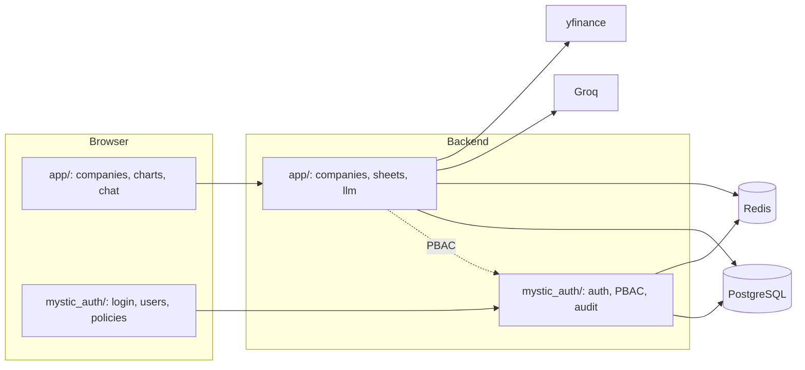
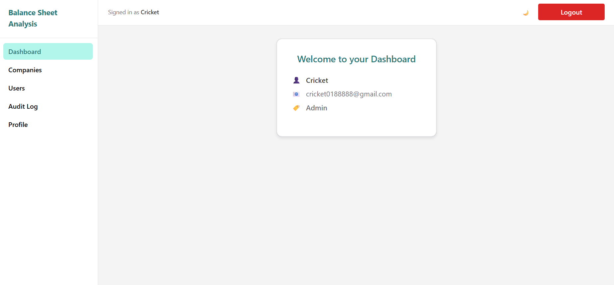
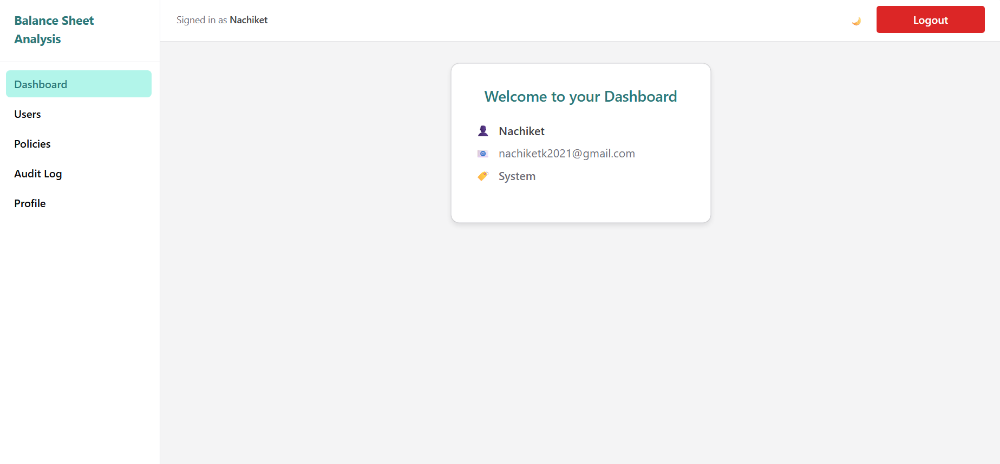
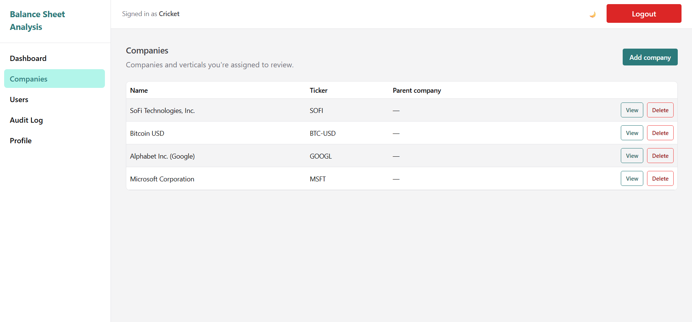
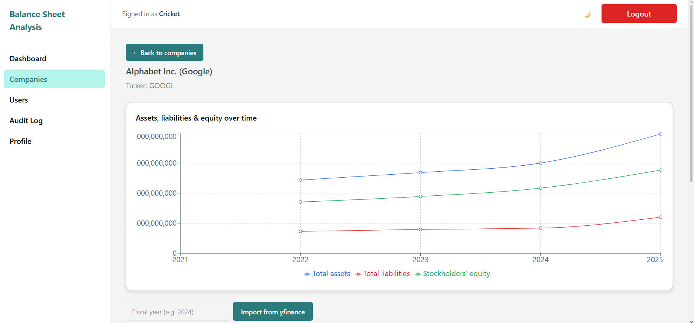
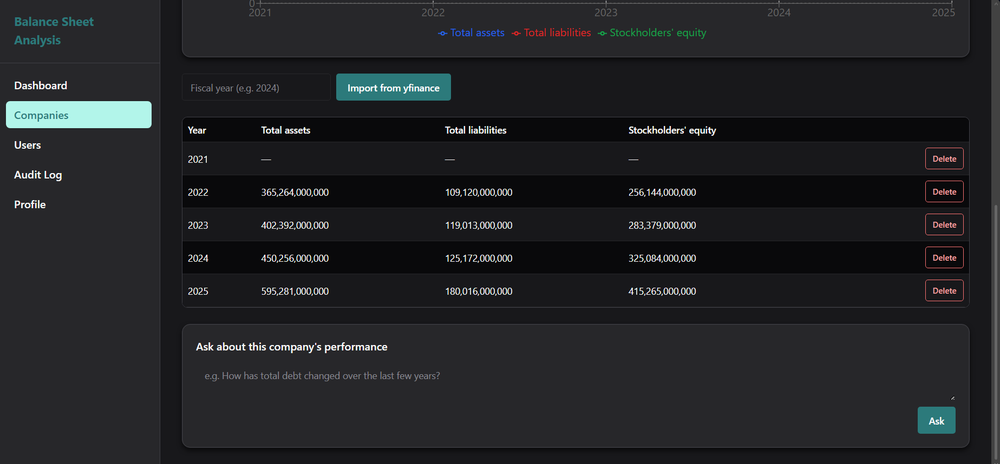
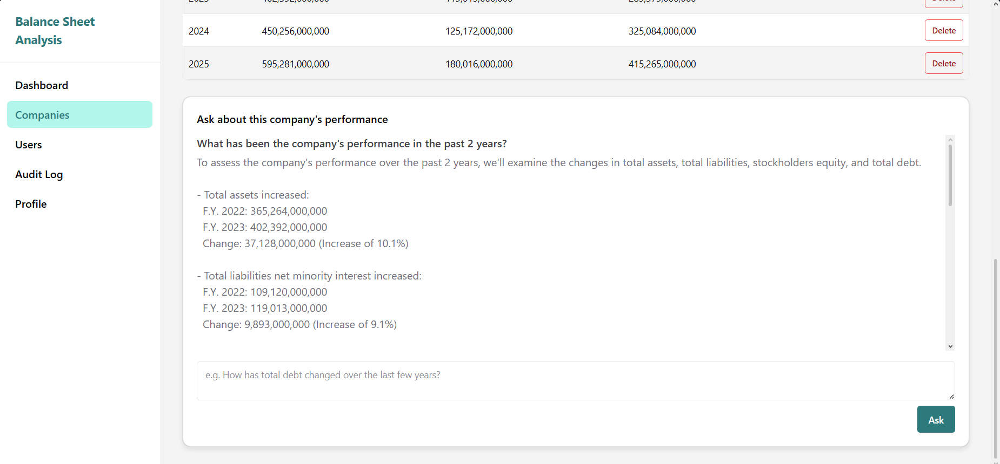
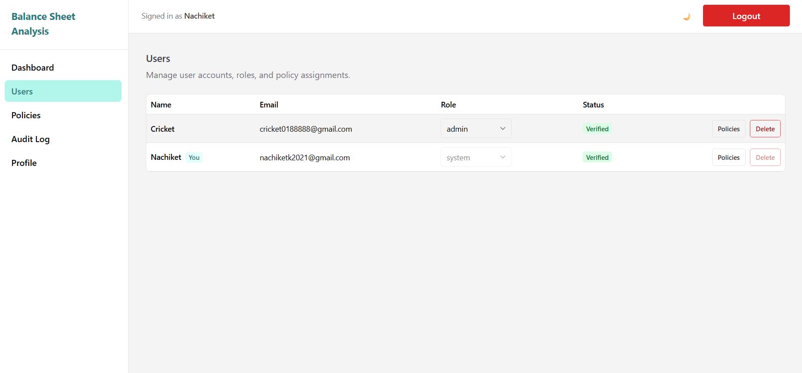
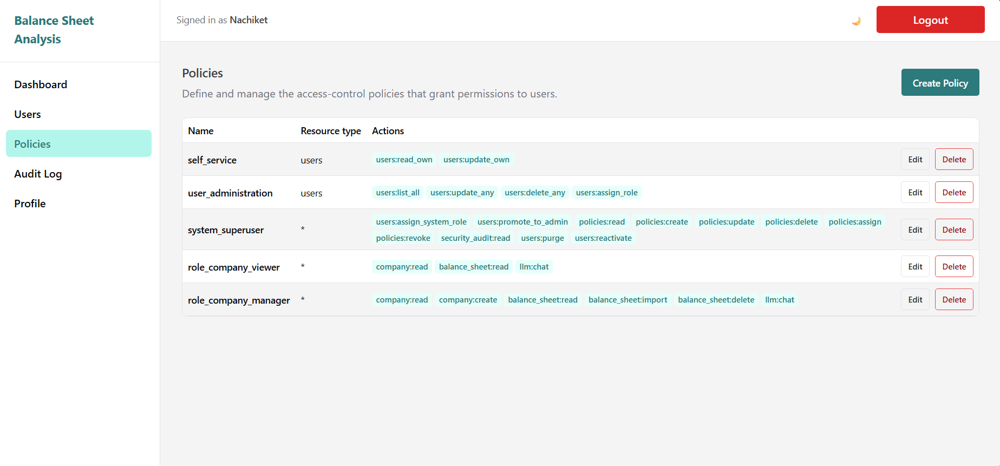

# Balance Sheet Analysis


---

## Overview

A ChatGPT-style balance-sheet analysis tool for company analysts and top-management: import a public company's balance sheet (via yfinance), review it across fiscal years with charts, and ask an LLM grounded questions about its performance, all gated by who's actually allowed to see that company's data.

Identity, sessions, and access control are provided by [mystic-auth](https://github.com/Nachiket-2024/mystic-auth), a full-stack auth/PBAC template, vendored in unmodified. See [`docs/mystic_auth/`](docs/mystic_auth/README.md) for what the template itself provides (login, PBAC, audit logging, Docker, CI/CD). **This project's own code and docs live in `backend/app/`, `frontend/src/app/`, and `docs/app/`**: see [`docs/app/README.md`](docs/app/README.md) for the full index.



See [Architecture](docs/app/architecture/README.md) for how `app/` and `mystic_auth/` are actually split on disk, and [Access Control](docs/app/access-control/README.md) for how `require_authorization` decides company/group scope.

### The access-control problem this solves

A company group (e.g. Reliance Industries, with verticals like Jio Platforms and Reliance Retail Ventures) needs each vertical's CEO to see only their own company's numbers, while group executives see the whole group, and analysts maintaining the data are scoped the same way, not given blanket access. See [`docs/app/access-control/`](docs/app/access-control/README.md) for exactly how this is modeled on top of mystic-auth's Policy-Based Access Control.

---

## Screenshots

### Dashboard
Regular account, holding one of this app's own baseline policies (`role_company_manager` here). Renders mystic-auth's own dashboard, unchanged.



---

### Dashboard (System Superuser)
The reserved system account, the only one that can reach the Users/Policies admin pages below.



---

### Companies
Every company the signed-in account's policies grant, scoped server-side, not filtered client-side. See [Access Control](docs/app/access-control/README.md).



---

### Company Detail
Fiscal-year trend chart (Recharts) for one company, plus the balance-sheet table and yfinance import control below it.



---

### Balance Sheet Table (Dark Mode)
Every fiscal year on file, with per-row delete and the yfinance import form above it.



---

### LLM Chat
Grounded in the actual imported balance-sheet figures for that company, not a general-purpose chatbot. See [Features](docs/app/features.md).



---

### Users
mystic-auth's own admin page, unmodified.



---

### Policies
This app's two ready-to-assign baseline policies, `role_company_viewer`/`role_company_manager`, sit alongside mystic-auth's own `self_service`/`user_administration`/`system_superuser` rows. See [Baseline Policies](docs/app/access-control/baseline-policies.md).



---

## ✨ Features

- **yfinance balance-sheet import**: pull a public company's balance sheet straight from Yahoo Finance by ticker and fiscal year, persisted per company. See [Features](docs/app/features.md).
- **Fiscal-year trend charts**: assets, liabilities, and stockholders' equity charted across every year on file (Recharts).
- **Grounded LLM chat**: ask questions about a specific company's performance; the actual imported figures are injected into the prompt, so answers are grounded in real data, not general knowledge. See [API Reference](docs/app/api.md).
- **Company-hierarchy access control**: a CEO sees only their own company, a group executive sees their whole group, an analyst is scoped the same way, all built on PBAC conditions rather than a role check. See [Access Control](docs/app/access-control/README.md).
- **Baseline RBAC-shaped policies, seeded automatically**: `role_company_viewer`/`role_company_manager` exist from the very first `docker compose up`, so a fresh install is usable immediately. Assign one from the Users/Policies UI, no conditions JSON to write by hand.
- **Real authentication, not a demo login**: email+password with Argon2 hashing, Google OAuth2/PKCE, JWT access+refresh tokens as httpOnly cookies, refresh-token rotation with reuse detection, rate limiting, and audit logging, all inherited from mystic-auth. See [`docs/mystic_auth/`](docs/mystic_auth/README.md).
- **Error monitoring, on by default**: backend and frontend exceptions reported to self-hosted Bugsink, started automatically by `docker compose up`. See [Error Monitoring](docs/mystic_auth/error-monitoring/overview.md).

---

## 🛠️ Stack

- **Backend:** FastAPI (async), SQLAlchemy 2.0 (async), Alembic. Companies/balance sheets/LLM chat live in `backend/app/`, on top of mystic-auth's auth/PBAC in `backend/mystic_auth/`
- **Frontend:** TypeScript, React 19 + Vite, Chakra UI v3, Recharts (balance-sheet trend charts). This app's pages live in `frontend/src/app/`
- **Data source:** [yfinance](https://github.com/ranaroussi/yfinance) for public balance-sheet data
- **LLM:** [Groq](https://groq.com/) chat completions, grounded in the actual imported balance-sheet figures, rate-limited per-IP/per-account
- **Database:** PostgreSQL (async), one shared Alembic migration history for this app's tables and mystic-auth's own
- **Authentication:** Email+password (Argon2) and Google OAuth2/PKCE, JWT access+refresh tokens as httpOnly cookies, via mystic-auth
- **Authorization:** Policy-Based Access Control (PBAC), mystic-auth's engine, this app's own company-scoped policies on top
- **Caching & background tasks:** Redis + Taskiq (async email delivery for signup/password-reset, mystic-auth, unchanged)
- **Error monitoring:** Self-hosted Bugsink, enabled by default alongside everything else
- **Deployment:** Docker (`docker-compose.yml` for dev, `docker-compose.prod.yml` for production)

---

## 📥 Installation

### 1. Clone the repository

```bash
git clone <this-repository-url>
cd balance_sheet_analysis
```

### 2. Set up the environment (only if running locally; skip if using Docker)

> Instructions below assume that you are at the root of the repository while running the commands.

Install backend dependencies:

```bash
cd backend
pip install -r requirements.txt
```

Install frontend dependencies (**Node 22.22+ required**: `react-router`/`@testing-library/jest-dom` declare that floor in their own `engines.node`; the Docker image and CI both pin `22.23.2`, matching what's below):

```bash
cd frontend
npm install
```

---

## ⚙️ Environment Variables

> Instructions below assume that you are at the root of the repository while running the commands.

All environment variables, backend and frontend (`VITE_*`) alike, are defined in one place, root `.env.example`. Copy it to `.env` and fill in your own values:

```bash
cp .env.example .env
```

Most values are prefilled with working (fake) defaults, but two are placeholders you need to fill in for a normal signup flow to actually work end to end:

- `GROQ_API_KEY`: without it, LLM chat requests fail with 502 (get a free key at [console.groq.com](https://console.groq.com/keys)); balance-sheet import and everything else works without it.
- `FROM_EMAIL`/`GMAIL_APP_PASSWORD`: without these, the verification email a fresh email+password signup needs never sends, and login is blocked for an unverified account (see `login_service.py`'s `is_verified` check), so signup silently dead-ends. Get a Gmail [App Password](https://myaccount.google.com/apppasswords) (needs 2FA enabled) for the account you want to send from. **The one way to skip this requirement**: sign in with Google instead of signing up with email+password, an OAuth2 account is auto-verified immediately (Google already confirmed the email), no SMTP involved at all. That path needs its own credentials instead: `GOOGLE_CLIENT_ID`/`GOOGLE_CLIENT_SECRET` (see [OAuth2/PKCE](docs/mystic_auth/authentication/oauth2-pkce.md)).

So at least one of the two, Gmail SMTP or Google OAuth2, needs real credentials before a new account can actually log in; which one depends on which signup path you want working. See [`docs/app/setup.md`](docs/app/setup.md) for this app's own env vars specifically.

---

## 🚀 Run the App

> Instructions below assume that you are at the root of the repository while running the commands.

### Path 1. Docker (Recommended)

Use the helper script for your shell (see [`docs/app/scripts.md`](docs/app/scripts.md) for this and every other script under `scripts/`):

```bash
# Git Bash, WSL, Linux, macOS
./scripts/dev-up.sh
```

```powershell
# PowerShell
.\scripts\dev-up.ps1
```

```bat
rem Command Prompt
scripts\dev-up.cmd
```

Starts the full stack and waits for every service to actually report healthy, not just "created", then settles into tailing only `backend`/`frontend`/`taskiq_worker` logs (their startup lines, API calls, the frontend dev server, async email-task execution) instead of every service's full startup noise. Postgres/Redis/Bugsink/Alembic startup output stays out of the way; they've already done their job by the time the tail starts. Backend exceptions still go to Bugsink ([http://localhost:8010](http://localhost:8010)), not this terminal. See [Docker Overview](docs/mystic_auth/docker/overview.md#day-to-day-dev-up-helpers) for the full rationale.

Want every service's full logs interleaved in one stream instead (e.g. debugging Postgres/Bugsink startup itself)? Plain `docker compose up` still does exactly that:

```bash
docker compose up
```

Every image (including the `frontend` service's local `mystic-auth-frontend:dev`, which isn't published anywhere) builds automatically on first run, no `--build` needed either way. Use `docker compose up --build` later only when you want to force a rebuild (e.g. after changing a Dockerfile or a dependency file); the image being cached means neither path above picks up that kind of change on its own.

Either path starts the entire stack: backend, frontend, Postgres, Redis, the Taskiq worker, and self-hosted Bugsink error monitoring, not just this app's own pieces. Migrations and this app's two baseline policies (`role_company_viewer`, `role_company_manager`) are applied automatically by the `alembic`/`seed-base-policies` services before `backend` starts serving traffic.

Once the services are running:

- **Backend:** [http://localhost:8000/docs](http://localhost:8000/docs), FastAPI API docs and endpoints
- **Frontend:** [http://localhost:5173](http://localhost:5173), React + Vite frontend
- **Bugsink** (error monitoring UI): [http://localhost:8010](http://localhost:8010)
- **PostgreSQL:** `localhost:5433` (non-default host port; containers reach it at `postgres:5432` internally)
- **Redis:** `localhost:6380` (non-default host port; containers reach it at `redis:6379` internally)

See [Docker Overview](docs/mystic_auth/docker/overview.md) for the full service breakdown and [Deployment Guide](docs/mystic_auth/deployment/guide.md) for production Compose usage.

---

### Path 2. Running Locally

> Make sure PostgreSQL and Redis are running locally, and the database exists. `.env.example`'s `DATABASE_URL`/`REDIS_URL` default to Docker service hostnames (`postgres`/`redis`), which only resolve inside the Docker network: for this path, override both in `.env` to point at `localhost` instead (e.g. `postgresql+asyncpg://postgres:<password>@localhost:5432/<db>` and `redis://localhost:6379/0`), or `localhost:5433`/`localhost:6380` if you're still running Postgres/Redis themselves via `docker compose up postgres redis` while running backend/frontend locally.

#### 1. Run Alembic migrations

```bash
cd backend
alembic upgrade head
```

This app's tables (`companies`, `balance_sheets`) share mystic-auth's own Alembic history, so one command applies both.

#### 2. Start the FastAPI backend

Run from the repo root: `app/` (this project) and `mystic_auth/` (vendored template) are separate top-level packages under `backend/`, bridged via `app/sdk.py`'s import helper, which resolves correctly whether `backend/` is on `sys.path` (this command) or `backend` itself is (Docker's `WORKDIR /app`).

```bash
uvicorn backend.app.main:app --reload
```

- **Backend:** [http://localhost:8000/docs](http://localhost:8000/docs)
- **PostgreSQL:** `localhost:5432`
- **Redis:** `localhost:6379`

#### 3. Start the Taskiq worker

```bash
taskiq worker backend.mystic_auth.taskiq_tasks.email_tasks:broker --reload
```

#### 4. Run the React frontend

```bash
cd frontend
npm run dev
```

- **Frontend:** [http://localhost:5173](http://localhost:5173)

> **Error monitoring (Bugsink) still requires Docker even in this local-run path**, it only ships as a container in this template, with no bare-metal install documented. Run `docker compose up bugsink bugsink-seed` alongside your locally-run backend/frontend if you want it. See [Error Monitoring](docs/mystic_auth/error-monitoring/overview.md).

---

## 🔑 First-Time Setup: Creating the System Superuser

After starting the app for the first time, create the reserved system account: a one-time step inherited from mystic-auth that seeds the account holding the `system_superuser` policy (and every other baseline policy). There is no API endpoint for this by design; CLI/shell access is the point.

### Docker

```bash
docker compose exec -it backend python -m mystic_auth.scripts.create_system_user
```

### Local

```bash
cd backend
python -m mystic_auth.scripts.create_system_user
```

You'll be prompted for a name, email, and password. This only needs to be run once: the system user persists in the database and can never be created, modified, or promoted via any API endpoint. See [System Superuser](docs/mystic_auth/authentication/system-superuser.md) for the full behavior.

Then, from the `/policies`/`/users` pages, assign `role_company_viewer` or `role_company_manager` to any account (your own included) to start using the app, with no conditions to write by hand. See [Baseline Policies](docs/app/access-control/baseline-policies.md).

Optionally, seed a disposable demo Reliance-group dataset (companies + a scoped analyst/CEO/group-exec, to see the company-hierarchy *scoping* model in action) with:

```bash
docker compose exec backend python -m app.seed.seed_demo_data
```

See [`docs/app/setup.md`](docs/app/setup.md) for the full detail on both.

---

## 📝 Notes

- All credentials and secrets are loaded from `.env`
- **Alembic** is used for database migrations, one shared history for this app's tables and mystic-auth's own
- **Redis + Taskiq** are used for async email delivery, caching, and rate limiting
- Signing up with email+password needs `FROM_EMAIL`/`GMAIL_APP_PASSWORD` configured; otherwise the verification email never sends and that account can never log in. Signing in with Google instead needs `GOOGLE_CLIENT_ID`/`GOOGLE_CLIENT_SECRET` but skips verification entirely (auto-verified). At least one of the two paths needs real credentials.
- `GROQ_API_KEY` is required for LLM chat specifically; everything else (companies, balance sheets, charts) works without it
- Error monitoring (self-hosted Bugsink) starts automatically with `docker compose up`; see [Error Monitoring](docs/mystic_auth/error-monitoring/overview.md)
- **Zustand** manages client-side session state; **TanStack Query** manages all server-state caching
- **Type Safety:** full TypeScript support across the frontend, `mystic_auth/` and this app's own `app/` alike

---

## 🧪 Testing

```bash
# Backend
docker compose exec backend python -m pytest tests/backend -q

# Frontend
docker compose exec frontend npm run test:coverage
```

CI (`.github/workflows/ci.yml`, inherited from mystic-auth) already lints, type-checks, and tests everything under `backend/app/` and `frontend/src/app/` alongside `mystic_auth/`'s own code, so no separate pipeline is needed for this app's additions. See [Testing](docs/mystic_auth/testing/overview.md).

---

## 📚 Documentation

- [`docs/app/`](docs/app/README.md): this project's own docs, architecture, access-control model, API reference, setup
- [`docs/mystic_auth/`](docs/mystic_auth/README.md): the template's own docs, authentication, PBAC, database, Docker, CI/CD, testing, deployment
- [`docs/mystic_auth/template-usage/overview.md`](docs/mystic_auth/template-usage/overview.md): how this repo can pull in future mystic-auth updates via `scripts/sync-upstream.sh`

For the underlying authentication/authorization system itself, how login, OAuth2, JWT/cookie handling, and Policy-Based Access Control actually work, see [mystic-auth](https://github.com/Nachiket-2024/mystic-auth) and its own documentation.

---

## 📄 License

MIT. See the [LICENSE](LICENSE) file for details.
