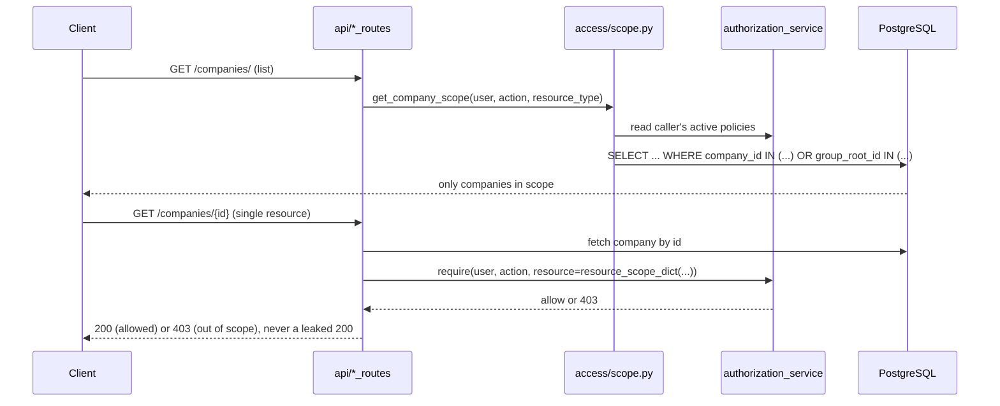

# Access Control: Enforcement Paths

See [Overview](overview.md) for the hierarchy model and policy shape this enforces.

## Two enforcement paths, deliberately different

- **List endpoints** (`GET /companies/`, listing "every company I can see"):
  `access/scope.py`'s `get_company_scope()` reads the caller's own active
  policies once and derives a SQL `WHERE company_id IN (...) OR
  group_root_id IN (...)` filter: a single query, and no PBAC audit-log
  entry is written per candidate row (which one authorization check per row
  would otherwise produce on every list request).
- **Single-resource endpoints** (`GET /companies/{id}`, balance sheet
  read/import/delete, LLM chat): fetch the specific row first, then call
  `authorization_service.require(..., resource=resource_scope_dict(company.id,
  company.group_root_id))`: exactly one authorization decision, and one
  audit-log entry, per real access to a specific resource. This is also what
  makes a request for a company outside the caller's scope come back as a
  clean 403 rather than a leaked 200.

Both paths ultimately read the *same* two condition keys
(`company_id`/`group_root_id`) off the *same* `resource_scope_dict()` helper.
`access/scope.py` is the one place this app's condition shape is defined.
