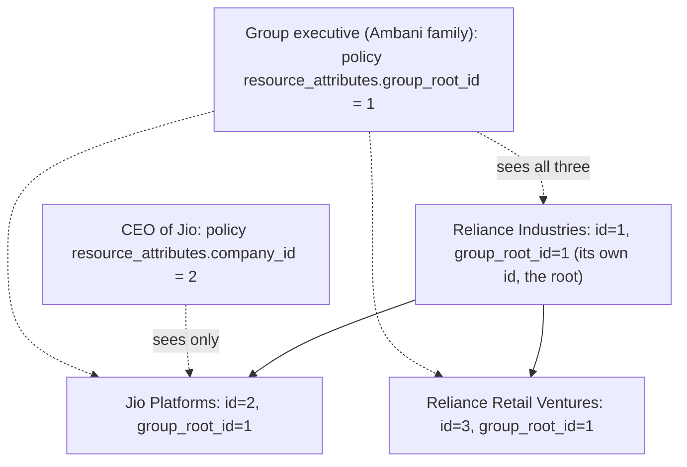

# Access Control: Companies and Groups

## The requirement

From the problem statement: Reliance Industries has multiple verticals (Jio
Platforms, Reliance Retail Ventures, ...). The CEO of one vertical should see
only that company's data; the Ambani family (group executives) should see
every company in the group. Analysts and top-management both need logins,
and, per this project's own access-model decision, analysts are scoped to
specific companies/groups too, not given blanket access to everything.

## Why this needs a denormalized column, not just `parent_company_id`

mystic-auth's PBAC evaluates a policy's `resource_attributes` condition as
**flat equality** against a field on the resource being checked (see
[`../../mystic_auth/authorization/condition-schema-reference.md`](../../mystic_auth/authorization/condition-schema-reference.md)):

```json
{"resource_attributes": {"company_id": 42}}
```

There's no "any descendant of X" traversal available at authorization time:
walking `parent_company_id` recursively on every request would also be slower
and harder to reason about than a flat column. So `Company` (see
`backend/app/companies/company_model.py`) carries a second column,
`group_root_id`: the id of the top-most ancestor (a root company's own id).
Granting "every company in this group" becomes exactly the same kind of flat
equality check as granting one company, just against a different column.

## The hierarchy, and who sees what



## How a policy is shaped

Every policy this app seeds uses `resource_type: "*"` (it spans the
`company`, `balance_sheet`, and `llm` resource types at once, since all three
use the same two condition keys) and one of:

| Persona                         | Condition                                  | Actions granted (see `access/permissions.py`)                          |
|----------------------------------|---------------------------------------------|--------------------------------------------------------------------------|
| CEO of one company               | `{"resource_attributes": {"company_id": X}}`   | `company:read`, `balance_sheet:read`, `llm:chat`                          |
| Group executive (e.g. the family) | `{"resource_attributes": {"group_root_id": Y}}` | `company:read`, `balance_sheet:read`, `llm:chat`                          |
| Analyst covering a group          | `{"resource_attributes": {"group_root_id": Y}}` | + `balance_sheet:import`, `balance_sheet:delete` (data maintenance)       |

`backend/app/seed/seed_demo_data.py` creates exactly this shape for a demo
Reliance group. See it for the concrete `policy_repository.create(...)` calls.

## See also

- [Enforcement](enforcement.md): the two different code paths that check these conditions
- [Baseline Policies](baseline-policies.md): the unconditioned starter policies seeded automatically
- [Onboarding](onboarding.md): why a fresh account starts with none of this, and how to grant it
