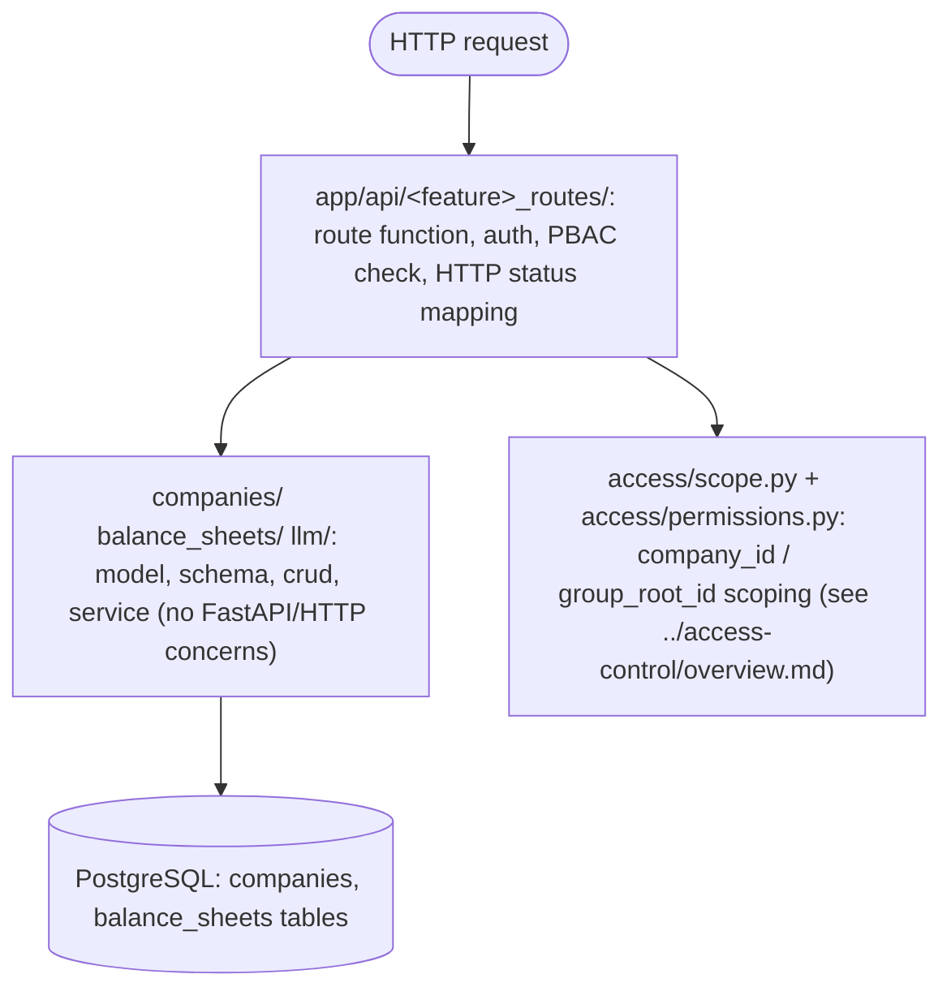

# Architecture: Conventions

See [Overview](overview.md) for the directory tree these rules produce.

## Why `api/` holds only axios clients, not hooks or components

Same reasoning as the backend's `api/<feature>_routes/` split (below): mystic_auth's
own frontend keeps every raw axios call function in one `api/` folder
(`users_api.ts`, `policies_api.ts`, `audit_api.ts`, ...), separate from the
feature folders (`users/`, `policies/`, `audit_log/`) that hold the actual
pages, react-query hooks, and dialogs built on top of those calls. This app
mirrors that split exactly: `company_api.ts`/`balance_sheet_api.ts`/`llm_api.ts`
live in `frontend/src/app/api/`; `companyQueries.ts`/`balanceSheetQueries.ts`
(the react-query hooks) and every page/widget component stay in their own
feature folders, importing the axios functions from `../api/<name>_api`.

## Why `access/` is its own folder, and not named `authorization`

`frontend/src/app/access/permissions.ts` only holds this app's own action-string
constants (`company:read`, `balance_sheet:import`, ...); it mirrors the
backend's `backend/app/access/` split (`permissions.py` + `scope.py`), kept
separate from mystic_auth's own `authorization/` folders on both sides.
mystic_auth's `frontend/src/mystic_auth/authorization/` holds the actual
enforcement mechanism (`IfCan`, `Authorized`, `ProtectedRoute`,
`useAuthorization`, `useCan`, `authorizationService`), which this app imports
and reuses unmodified; it does not reimplement any of it. Naming this app's
folder `authorization` would wrongly suggest it holds that mechanism. `access`
keeps the naming symmetric with the backend and keeps "our permission
vocabulary" visually distinct from "mystic_auth's enforcement plumbing."

## Why routes live under `app/api/<feature>_routes/`, separate from the domain code

mystic_auth itself splits domain logic (`auth/`, `authorization/`, `user_table/`,
`user_crud/`, ...) from the HTTP layer (`api/auth_routes/`, `api/pbac_routes/`,
`api/user_routes/`, ...); routes are thin, importing services/CRUD from
elsewhere in the tree. This app mirrors that exactly: `companies/`,
`balance_sheets/`, and `llm/` hold models/schemas/CRUD/services only; every
route function lives in `app/api/<feature>_routes/<feature>_routes.py`.

One consequence of this split, worth calling out explicitly: `app_sdk.py`
re-exports mystic_auth internals (`Base`, `policy_repository`,
`rate_limiter_service`) that the domain modules (`companies/company_model.py`
etc.) import, so `app_sdk.py` must never import this app's own routers,
or `app_sdk.py` -> routers -> domain modules -> `app_sdk.py` becomes a real
circular import. `main.py` imports the three routers directly from
`api/<feature>_routes/` instead of through `app_sdk.py` for exactly this
reason (see `app_sdk.py`'s own docstring).
